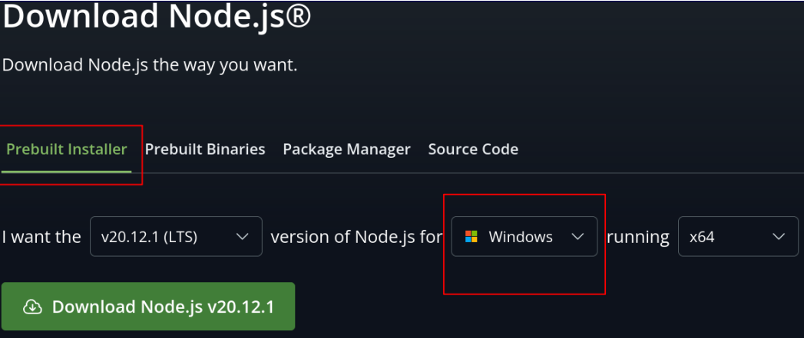
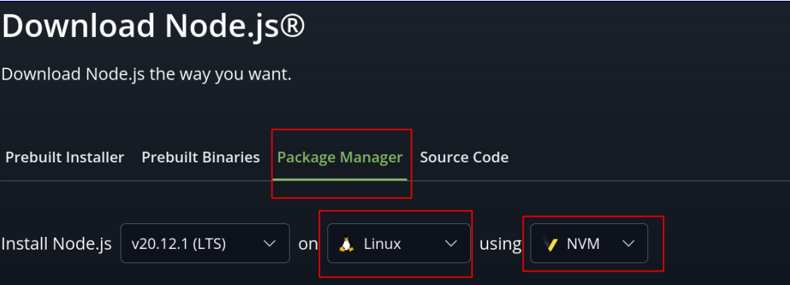

# Configuración del entorno de desarrollo para Laboratorio 3

Vamos a comentar 2 alternativas, una utilizando Docker y otra instalando todos los componentes necesarios sobre la máquina host.


# Instalando todo sobre la máquina host

## Instalar NodeJs

1. Ingresar a [NodeJs - Descargas](https://nodejs.org/en/download/) y seleccionar según la plataforma en la que nos encontremos el instalador que mejor se adapte a nuestro sistema operativo.

👉 En el caso de Windows, seleccionar los instaladores que se encuentran en la pestaña "Prebuilt Installer"



👉 En el caso de MacOs o Linux, seleccionar la pestaña "Package Manager" y seleccionar "NVM" en el último combo. Luego copiar y ejecutar en una terminal los comandos que se muestran.



⚠️ **En todos los casos seleccionar alguna versión estable (LTS)**


## Directorio de trabajo

Una vez instalado node, debemos crear el directorio en el cual vamos a desarrollar.
Crear un directorio, que será el directorio del proyecto a utilizar y dentro del mismo descomprimir el archivo 📦 *bootstrap.zip*.

Este archivo contiene lo siguiente:

📂/
 - 📂 src: directorio donde crearemos todos los archivos typescript (\*.ts)
  - 📄 index.ts: archivo de prueba. A futuro será nuestro punto de entrada.
 - 📂 tests: directorio donde crearemos las pruebas unitarias 
 - 📄 package.json: este archivo contiene los comandos a utilizar en el desarrollo y los paquetes necesarios para construir nuestra solución.
 - 📄 tsconfig.json: este archivo contiene la configuración utilizada en el proceso de "compilación"
 - 📄 jest.config.js: este archivo contiene la configuración utilizada durante la ejecución de las pruebas unitarias.
 - 📄 README.md: este archivo.


## Instalar las dependencias

Desde una terminal, ingresar al directorio de trabajo creado y ejecutar el siguiente comando: 

```bash
# comando que permite instalar los paquetes especificados en el archivo package.json
user@host:~$ npm i
```

## Compilar el proyecto

Desde una terminal, ingresar al directorio de trabajo creado y ejecutar el siguiente comando: 

```bash
# comando que permite compilar la solución.
user@host:~$ npm run build
```

## Configurar VisualCode (IDE)

Instalar los siguientes complementos:

* [ESLint](https://marketplace.visualstudio.com/items?itemName=dbaeumer.vscode-eslint).
* [JEST](https://marketplace.visualstudio.com/items?itemName=Orta.vscode-jest)
* [PlantUML](https://marketplace.visualstudio.com/items?itemName=jebbs.plantuml)
